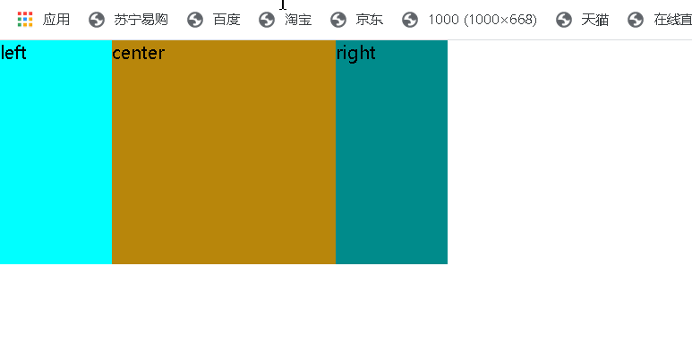

# CSS 之三栏布局

常见的布局方式: float布局、Position定位、table布局、弹性(flex)布局、网格(grid)布局

那么我们就是用以上5种方式完成三栏布局，中间宽度自适应



### 1.flex布局

左中右三列，父元素display: flex;两侧元素设宽；居中子元素flex: 1;

```html
 <style>
        *{
            padding: 0;
            margin: 0;    
        }
        .flex{
            width: 400px;
            height: 200px;
            display: flex;
        }
        .left{
            /* flex:0 1 100px; */
            width: 100px;
            background-color: cyan;
            /* margin-right: 20px;
            order:-1; */
        }
        .right{
            /* order: 1;
            flex: 0 1 100px;
            margin-left: 20px; */
            width: 100px;
            background-color: darkcyan;
        }
        .center{
            /* flex-grow: 1; */
            flex:1;
            background-color: darkgoldenrod;
        }
    </style>
 -----------------------------------------------------css

     <div class="flex">     
        <div class="left">left</div>
          <div class="center">center</div>
         <div class="right">right</div>
    </div>


```


### 2.float布局

左右中三列，左列左浮动，右列右浮动，中间列不设宽度

```css
<style>
        *{
            margin: 0;
            padding: 0;
        }
        .left{
            float: left;
            width: 100px;
            height: 300px;
            background-color: blue;
        }
        .right{
            float: right;
            width: 200px;
            height: 300px;
            background-color: chartreuse;
        }
        .middle{
            height: 300px;
            overflow: hidden;
            background-color: cyan;
        }
---------------------------------------------------------
       <div class="left"></div>  
        <div class="right"></div>
        <div class="middle"></div>
```


### 3.Grid布局

左中右三列，父元素display: grid;利用网格实现

```css
 <style>  
        .grid{
            display: grid;
            width: 100%;
           grid-template-columns: 100px auto 200px;//设置3列
           grid-template-rows: 100px;   //设置高度
           border: 1px solid #000;
        }
        .right{
            background-color: dodgerblue;
        }
        .left{
            background-color: firebrick;
        }
        .center{
            background-color: fuchsia;
        }          
    </style>
---------------------------------------------
     <div class="grid">
        <div class="left"></div>
        <div class="center"></div>
        <div class="right"></div>
    </div>
```


### 4.position布局

左中右三列（无顺序），根据定位属性去直接设置各个子元素位置

```css
<style>
        *{
            padding: 0;
            margin: 0;
        }
        .left{
            position: absolute;
            left: 0;
            width: 300px;
            background-color: fuchsia;
        }
        .center{
            position: absolute;
            left: 300px;
            right: 300px;
            background-color: goldenrod;
        }
        .right{
            position: absolute;
            right: 0;
            width: 300px;
            background-color: green;
        }
--------------------------------------------------
<body>
    <div class="position">
        <div class="left">left</div>
        <div class="center">center</div>
        <div class="right">right</div>
    </div>
</body>
```


### 5.table布局

左中右三列，父元素display: table;子元素display: table-cell;居中子元素不设宽度

```css
 <style>
        *{
            margin: 0;
            padding: 0;
        }
        .table{
            width: 500px;
            height: 300px;
            display: table;
        }
        .left{
            display: table-cell;
            width: 150px;
            background-color: darkgoldenrod;
        }
        .right{
            display: table-cell;
            width: 150px;
            background-color: darkgreen;
        }
        .center{
            display: table-cell;
            background-color: darkorchid;
        }
-------------------------------------------------------
<body>
    <div class="table">
        <div class="left"></div>
        <div class="center"></div>
        <div class="right"></div>
    </div>
</body>
```

